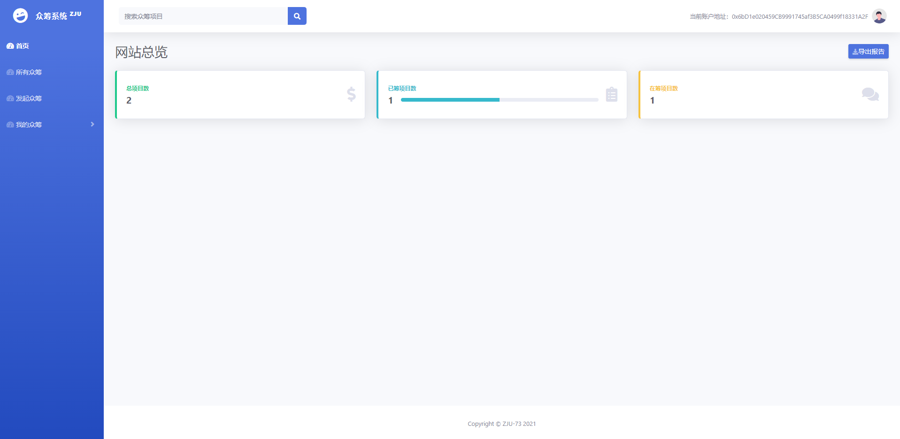

# 众筹Dapp项目部署说明

### 配置环境

1. 在运行该项目前，您需要配置Dapp运行的相关环境，您需安装`React`+`Web3`+`npm`+`truffle`，同时您还应在chrome中安装MetaMask。

### 运行

1. 使用`Ganache`导入`truffle-config.js`

2. 将`Ganache`中部署好的合约地址复制粘贴进`client/src/eth/punching.js`299行的`address`变量

3. 编译`solidity`文件：

   `truffle migrate`

4. 通过命令行进入`client`目录下：

   `cd clent`

5. 通过`npm`安装项目依赖的包：

   `npm install`

6. 启动项目：

   `npm run start`

7. 启动成功后项目会运行在`localhost:3000`端口

### 运行成功界面截图

1. 主界面

   

2. 查看All Punches项目界面

   

3. 查看项目详情页

   

4. Initiate a Punch页

   

5. 我发起的项目详情页

   

   

6. Punches Participated详情页

   

   

### 网站视频演示

https://www.bilibili.com/video/BV1gz4y1S7ny